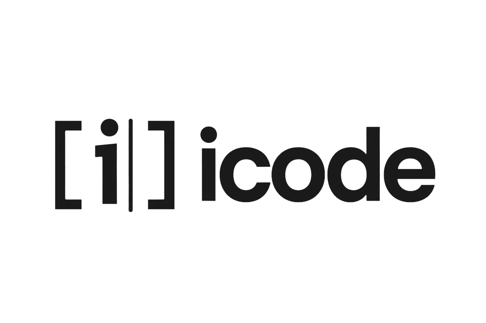

<p align="center">
  
</p>

<h3 align="center">iCode — AI-powered Code Editor</h3>

<p align="center">
  Built on the VS Code open-source codebase. Identical editor experience, rebranded as <strong>iCode</strong>, with a native AI coding agent built in.
</p>

---

## What is iCode?

iCode is a full desktop IDE (Windows, macOS, Linux) forked from
[VS Code (Code - OSS)](https://github.com/microsoft/vscode) and branded as
**iCode**. It looks and behaves exactly like VS Code — same extensions, same
keybindings, same performance — with one addition: an integrated AI coding
agent that can chat, plan, and edit files for you.

## Features

- **Full VS Code editor** — file explorer, integrated terminal, extensions
  marketplace, source control, debugging, and all built-in language support.
- **Built-in AI agent** — open the **iCode AI** sidebar to chat with an
  autonomous coding agent that reads your project, plans changes, and edits
  files directly.
- **Cross-platform** — native installers for Windows (.exe), macOS (.dmg), and
  Linux (.deb / .AppImage).
- **MIT licensed** — same open-source license as upstream VS Code.

## Building from source

Local Linux build (verified on Ubuntu 24.04+ / Node 24):

```bash
# 1. System build tools (g++ and the X11/secret dev libs VS Code's native modules need)
sudo apt-get install -y build-essential pkg-config \
  libx11-dev libx11-xcb-dev libxkbfile-dev libsecret-1-dev libkrb5-dev

# 2. Install dependencies (postinstall also installs build/ + extension/ deps)
PLAYWRIGHT_SKIP_BROWSER_DOWNLOAD=1 npm ci

# 3. Build the app
npm run gulp vscode-linux-x64-min

# The built app is in ../VSCode-linux-x64/ relative to the repo root
```

Windows (PowerShell) and macOS only need `PLAYWRIGHT_SKIP_BROWSER_DOWNLOAD=1 npm ci`
then `npm run gulp vscode-win32-x64-min` / `vscode-darwin-x64-min` (or `-arm64-min`).

See the [full build guide](BUILDING.md) for Windows and macOS.

## Installers via CI

GitHub Actions builds installers on tag pushes (`v*.*.*`), pull requests, and manual dispatch:

| Platform | Artifact |
|----------|----------|
| Windows x64 | `iCodeSetup-*.exe` (system + user installers) |
| macOS x64 / arm64 | `.dmg` (drag-to-install) |
| Linux x64 / arm64 | `.deb` + `.rpm` + portable `.tar.gz` |

## Repository layout

```
product.json              ← brand: nameShort, applicationName, icons, etc.
extensions/icode-ai/      ← the integrated AI agent sidebar extension
build/                    ← gulp tasks, CI workflows, installer scripts
resources/                ← app icons (code.png, code.ico, code.icns)
src/vs/workbench/         ← workbench shell (mostly untouched from VS Code)
```

## Contributing

Contributions follow upstream VS Code conventions. Run
`node ./node_modules/gulp/bin/gulp.js compile-extension:...` to type-check,
and `npm run lint` before submitting (see upstream docs for details).

## License

MIT — same as [VS Code](https://github.com/microsoft/vscode/blob/main/LICENSE.txt).
